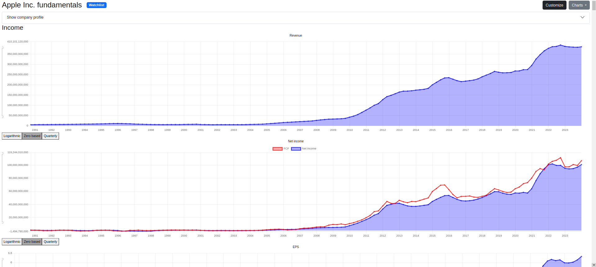
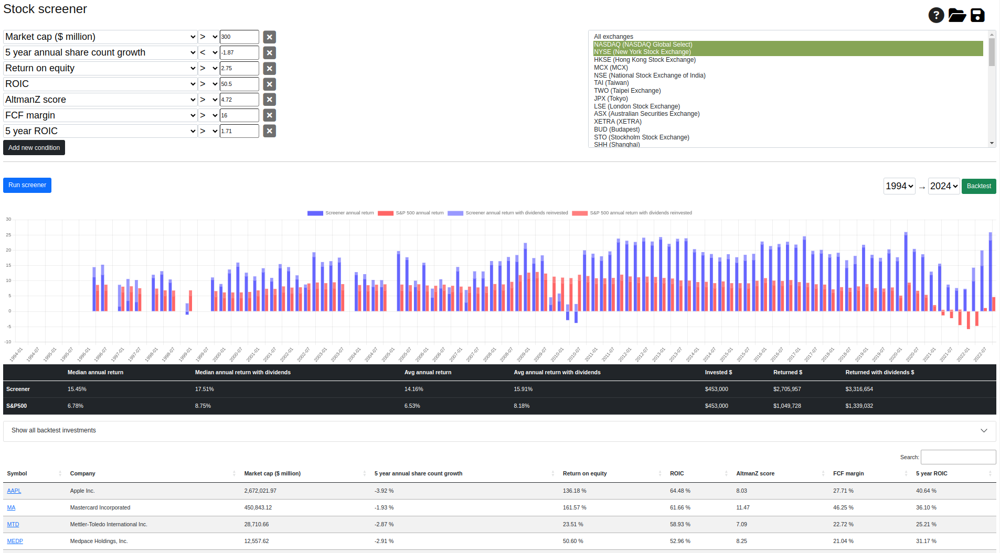
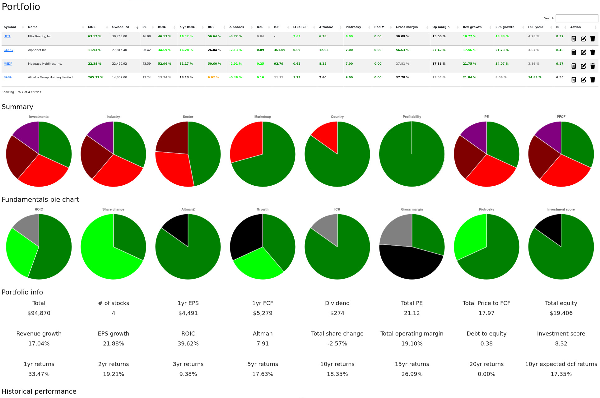
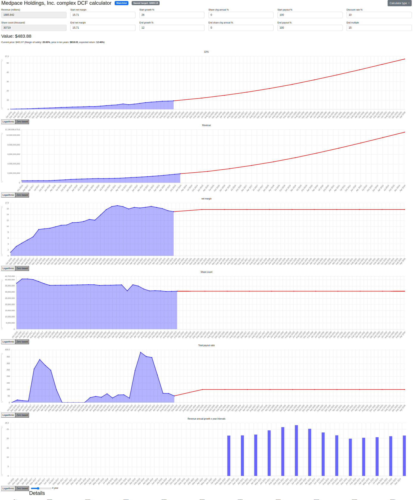

## LongTermStockFundamentals

Investment platform previously behind longtermstockfundamentals.com used to analyze stock fundamentals over the long term.

Features:
 - Visualize long term stock data, including but not limited to: revenue, earning, EPS, balance sheet, ROIC, AltmanZ score, etc.
 - Complex and fast stock screener
 - Backtest stock screener and compare returns to S&P500
 - Manage portfolio, track performance
 - Highlight risks in investment
 - Run DCF calculations (and provide data based on historical trend to properly fill out parameters)
 - Provides quick summary and overview of company fundamentals
 - Promotes long term oriented fundamental based investing

Sample stock charts:

See more images on the bottom of the README.

### Usage

First you need to download the fundamental data. You only need to do this once (and every once in a while to update the data):

 - You need a license to https://site.financialmodelingprep.com/developer/docs/ to download the financial fundamental data (currently cheapest is $19/month).
 - You also need a free API key to https://apilayer.com/marketplace/currency_data-api
 - Run com.helospark.financialdata.util.StockDataDownloader as Java application, and give `-DAPI_KEY=FINANCIALMODLINGPREP_API_KEY -DAPI_LAYER_API_KEY=APILAYER_API_KEY` as VM arguments
    - By default it will download it under your: `~/Documents/financials`
 - You may want to filter what to download by commenting out unnecessary symbols. By default it downloads all known stocks (about 40 000 stocks, ~20GB).

Then run the DB and graphite instance using docker-compose in the base directory like:

    docker-compose up

Finally you can run the application: `com.helospark.financialdata.FinancialDataApplication` as Java application using parameters:

    -Xmx4200m -DSTOCK_CACHE_SIZE=100 -DFX_CACHE_SIZE=100 -DAPI_KEY=FINANCIALMODLINGPREP_API_KEY

You will then be able to reach the UI on http://localhost:8080

Default (admin) account to login:
 - Username: root@longtermstockfundamentals.com
 - Pass: changeme1

You can change the default user in DynamoDbInitializer class.

To get full functionality, you also have to pass `-Dspring.profiles.active=development-secret` and create a application-development-secret.properties file from the secrets at the bottom of application.properties properly filled out (needed for registration, Stripe integration).

To run in production environment pass the the right active profile and create the necessary properties file.

### Utils

There are utils under `com.helospark.financialdata.util`, these are separate applications.

 - StockDataDownload - Downloads data from financialmodelingprep
 - CompanyScreener - Find stocks with certain properties or does backtest. You can find multiple implementations under analyzer package.
 
 
### Dev notes

**Generate new JWT signing keys**

    openssl genrsa -out jwt2.pem 2048
    openssl rsa -in jwt2.pem -pubout > jwt2.pub

**Generate new DKIM keys**

    openssl genrsa -out dkim_private.pem 2048
    openssl pkcs8 -topk8 -inform PEM -outform DER -nocrypt -in dkim_private.pem -out dkim_private.der

Copy the above private key to src/main/resources/dkim folder.
Then get the public key and copy it as DNS TXT record with `email._domainkey` subdomain (`email` is the selector):

    openssl rsa -in dkim_private.pem -pubout -outform der 2>/dev/null | openssl base64 -A

**Create SPF1 and DMARC**

Create TXT records in your DNS for root sender domain:

    v=spf1 ip4={SENDER_IP} ~all

Create dmarc record with sub-domain `_dmarc`:

    v=DMARC1; p=quarantine; rua=mailto:support@longtermstockfundamentals.com

    
### Images

#### Screener and backtest:

#### Portfolio summary:

#### DCF calculator:

